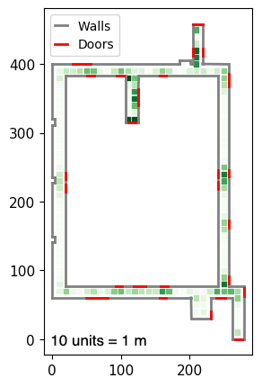
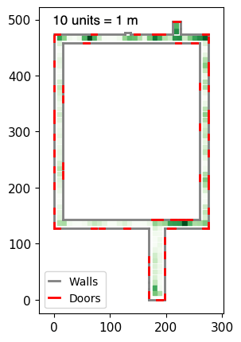
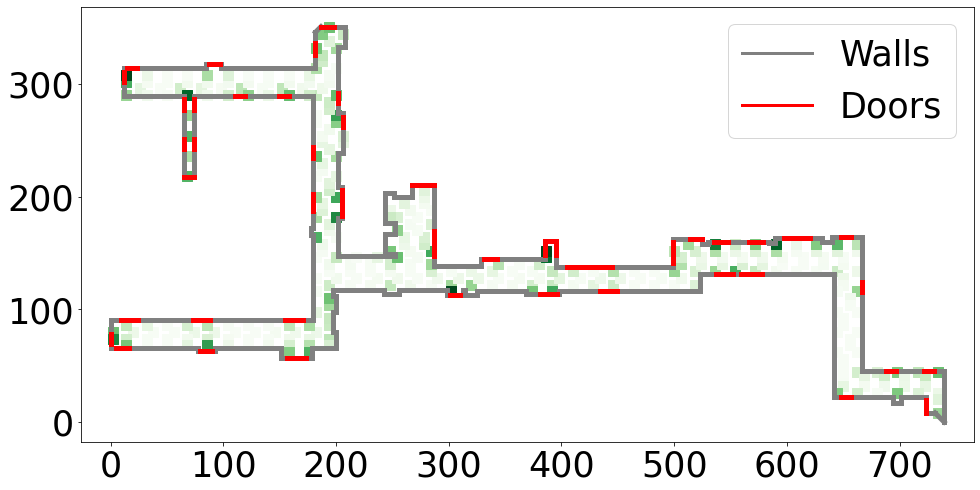

<!--# FloorPlanLocalization-->
# Floor Plan Based Active Global Localization And Navigation Aid For The Visually Impaired

## 📄 Abstract

Navigation of an agent, such as a visually impaired person, in an unfamiliar environment poses substantial difficulties, even in scenarios where floor plans are available. It becomes essential to first determine the agent’s pose in the environment. The task grows more complex when the agent must also be provided with commands for environment exploration. This problem of active global localization typically involves finding a transformation to match the agent’s sensor-generated map to the existing floor plan while providing a series of strategic actions for effective exploration. Current methods fall into two categories: learning-based, requiring extensive training for each environment, or non-learning-based, which generally depend on prior knowledge of the agent’s initial position, or use floor plan maps created with the same sensor modality as the agent. Addressing these limitations, we introduce a novel system for real-time, active global localization and navigation for the visually impaired. By generating semantically informed real-time goals, our approach enables local exploration and
the creation of a 2D semantic point cloud for effective global localization. Moreover, it dynamically corrects for odometry drift using the architectural floor plan, independent of the agent’s global position, and introduces a new method for real-time loop closure on reversal. Our approach’s effectiveness and practicality are validated through multiple real-world indoor experiments, also highlighting its adaptability and ease of extension to any mobile robot.

## 📊 Results

### Mean and Median of the distance traveled (meters) for successful localization
| Method             | Candidate creation (Mean) | Candidate creation (Median) | Candidate confirmation (Mean) | Candidate confirmation (Median) |
|--------------------|--------------------------|---------------------------|-------------------------------|----------------------------|
| Left wall follower | 14.79                    | 11.03                     | 17.36                         | 14.05                      |
| Random coin toss   | 16.76                    | 11.43                     | 19.53                         | 16.16                      |
| Our method         | 11.76                    | 9.72                      | 14.14                         | 12.22                      |

### Mean and Meadian of the distance traveled (meters) from start to target
| Method                 | Distance travelled (Mean) | Distance travelled (Median) |
|------------------------|---------------------------|--------------------------|
| Min. possible distance | 31.86                     | 28                    |
| Left wall follower     | 51.58                     | 50.84                    |
| Random coin toss       | 50.47                     | 51.23                    |
| Our method             | 44.11                     | 41.45                    |

## 📑 Abalation Study
$R_1=L_4$, $R_2=L_{12}$, $R_3=L_{10}$, $R_4=L_{16}$, $R_5=L_{7}$ from the tables at the end.
### Distance traveled for localization (in meters)
|             | $R_1$ | $R_2$ | $R_3$ | $R_4$ | $R_5$ | Avg. |
|-------------|-------|-------|-------|-------|-------|------|
| Our method  | 4.9   | 4.1   | 18.1  | 16.4  | 9.4   | 10.6 |
| No Loop Closure | 5.8 | 4.4 | 22 | 15.5 | 15.2 | 12.6 |
| No Drift Correction | 4.1 | 13.5 | 13.6 | 13.2 | 11.1 | 11.1 |
| Path to Target | 16 | 3.8 | 40.4 | 9.5 | 20.3 | 18 |

### Distance traveled for overall navigation (in meters)
|             | $R_1$ | $R_2$ | $R_3$ | $R_4$ | $R_5$ | Avg. |
|-------------|-------|-------|-------|-------|-------|------|
| Our method  | 36.6  | 55.3  | 68.7  | 26.4  | 41.8  | 45.7 |
| No Loop Closure | 47.2 | 58.5 | 76.4 | 21.5 | 72.8 | 55.3 |
| No Drift Correction | 36 | 23.2 | - | - | - | - |
| Path to Target | 16.5 | 60.2 | 64.7 | 17.4 | 44.5 | 40.6 |

## TEST BLOCK                                                                                                                                  
### Experiment paths ($10$ units $=$ $1$ m)

*Figure 1: Environment 1 FloorMap*

<a href="#" style="float: right;"> <!-- An anchor tag with a right float style -->

| Index | Starting Point (X) | Starting Point (Y) | End Point (X) | End Point (Y) | Candidate Creation | Candidate Confirmation |
| ----- | ------------------- | ------------------- | -------------- | -------------- | ------------------ | ------------------ |
| $L_1$     | 95                  | 390                 | 10             | 270            | 9.13              | 9.40            |
| $L_2$     | 250                 | 77                  | 10             | 270            | 39.58             | 39.69            |
| $L_3$     | 250                 | 250                 | 10             | 270            | 17.73             | 24.27            |
| $L_4$     | 50                  | 70                  | 10             | 270            | 4.98             | 6.25           |
| $L_5$     | 26                  | 390                 | 10             | 270            | 0.21             | 0.78           |
| $L_6$     | 115                 | 320                 | 50             | 70             | 9.72             | 12.97            |
| $L_7$     | 210                 | 450                 | 50             | 70             | 4.11              | 6.71            |
| $L_8$     | 195                 | 70                  | 50             | 70             |6.68              | 7.16             |
| $L_9$     | 277                 | 70                  | 50             | 70             | 1.25              | 1.69            |
| $L_{10}$    | 127                 | 392                 | 50             | 70             | 18.12              | 26.08            |
| $L_{11}$    | 275                 | 70                  | 115            | 330            | 8.83              | 10.63            |
| $L_{12}$    | 10                  | 385                 | 115            | 330            | 16.42              | 22.53            |
| $L_{13}$    | 248                 | 248                 | 115            | 330            | 21.59              | 24.22           |
| $L_{14}$    | 70                  | 70                  | 115            | 330            | 17.44              | 20.26            |
| $L_{15}$    | 210                 | 450                 | 115            | 330            | 8.28             | 11.43            |
| $L_{16}$    | 50                  | 390                 | 250            | 200            | 9.43             | 11.36            |
| $L_{17}$    | 230                 | 70                  | 250            | 200            | 20.82             | 22.84            |
| $L_{18}$    | 250                 | 250                 | 250            | 200            | 18.85              | 22.43            |
| $L_{19}$    | 118                 | 70                  | 250            | 200            | 15.43              | 17.91            |
| $L_{20}$    | 10                  | 240                 | 250            | 200            | 24.90             | 32.53            |

</a>

               
*Figure 2: Environment 2 FloorMap*

<a href="#" style="float: right;"> <!-- An anchor tag with a right float style -->

| Index | Starting Point (X) | Starting Point (Y) | End Point (X) | End Point (Y) | Candidate Creation | Candidate Confirmation |
| ----- | ------------------- | ------------------- | -------------- | -------------- | ------------------ | ------------------ |
| $L_{21}$     | 198                 | 135                 | 155            | 470            | 7.24              | 7.67            |
| $L_{22}$     | 225                 | 465                 | 155            | 470            | 6.01              | 6.79            |
| $L_{23}$     | 8                   | 131                 | 155            | 470            | 1.17              | 1.39            |
| $L_{24}$     | 220                 | 133                 | 175            | 75             | 0.99              | 1.27             |
| $L_{25}$     | 266                 | 382                 | 175            | 75             | 12.85             | 14.03            |
| $L_{26}$     | 10                  | 255                 | 175            | 75             | 2.59              | 3.45            |
| $L_{27}$     | 219                 | 490                 | 175            | 75             | 0.01              | 0.01            |
| $L_{28}$     | 170                 | 135                 | 219            | 490            | 5.82              | 6.26            |
| $L_{29}$     | 268                 | 219                 | 219            | 490            | 11.95             | 12.71            |
| $L_{30}$    | 8                   | 415                 | 219            | 490            | 11.80             | 12.47            |

</a>

               
*Figure 2: Environment 3 FloorMap*

<a href="#" style="float: right;"> <!-- An anchor tag with a right float style -->

| Index | Starting Point (X) | Starting Point (Y) | End Point (X) | End Point (Y) | Candidate Creation | Candidate Confirmation |
| ----- | ------------------- | ------------------- | -------------- | -------------- | ------------------ | ------------------ |
| $L_{31}$     | 25                 | 300                 | 195            | 150            | 20.61              | 24.32            |
| $L_{32}$     | 70                 | 225                 | 195            | 150            | 0.24              | 0.77            |
| $L_{33}$     | 275                   | 175                 | 195            | 150            | 12.49              | 22.47            |
| $L_{34}$     | 305                 | 120                 | 500            | 125             | 25.54              | 32.46             |
| $L_{35}$     | 655                 | 35                 | 500            | 125             | 14.54             | 17.24            |

</a>

