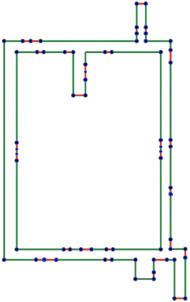
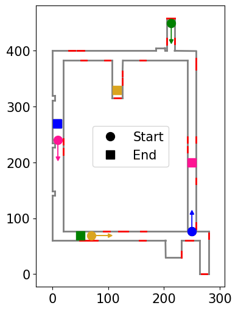

<!--# FloorPlanLocalization-->
# Real-Time Visually Assisted System for Indoor Localization and Navigation From Unknown Start Locations

## 📄 Abstract

A novel methodology is developed to navigate an agent (e.g., a robot or a visually impaired person) to target locations specified in an a priori architectural floor plan starting from unknown locations. An active global localization method is proposed to create semantically aware a priori map based real-time goals for the agent to safely and intelligently explore the local environment while simultaneously constructing a semantic point cloud (SPCL) to globally localize the agent. The agent navigates to the target on successful localization by planning the shortest path from the estimated current location. Furthermore, a method is proposed to dynamically correct the time-varying odometry drift without knowing the global pose of the agent. The efficacy of the proposed algorithm is shown by conducting experiments in an indoor environment.

| Architectural Floor Plan                         | Point Cloud                 | Semantic Point Cloud              |
| :--------------------------------:| :--------------------------:| :--------------------------:|
|  |   |   |

## 📊 Results
### Experiment paths ($10$ units $=$ $1$ m)
| Enviroment 1                         | Enviroment 2                 |
| :--------------------------------:| :--------------------------:|
|  |   |

### Mean and standard deviation of the distance traveled (meters) for successful localization
| Method             | Candidate creation (Mean) | Candidate creation (Std) | Candidate confirmation (Mean) | Candidate confirmation (Std) |
|--------------------|--------------------------|---------------------------|-------------------------------|----------------------------|
| Left wall follower | 13.25                    | 10.55                     | 15.64                         | 11.63                      |
| Random coin toss   | 15.03                    | 13.96                     | 17.62                         | 15.66                      |
| Our method         | 11.27                    | 9.31                      | 13.25                         | 10.36                      |

### Mean and standard deviation of the distance traveled (meters) from start to target
| Method                 | Distance travelled (Mean) | Distance travelled (Std) |
|------------------------|---------------------------|--------------------------|
| Min. possible distance | -                         | -                        |
| Left wall follower     | 52.03                     | 20.88                    |
| Random coin toss       | 51.19                     | 21.78                    |
| Our method             | 44.97                     | 20.20                    |

## 📑 Abalation Study
### Distance traveled for localization (in meters)
|             | $R_1$ | $R_2$ | $R_3$ | $R_4$ | $R_5$ | Avg. |
|-------------|-------|-------|-------|-------|-------|------|
| Our method  | 4.9   | 4.1   | 18.1  | 16.4  | 9.4   | 10.6 |
| No Loop Closure | 5.8 | 4.4 | 22 | 15.5 | 15.2 | 12.6 |
| No Drift Correction | 4.1 | 13.5 | - | - | - | - |
| Path to Target | 16 | 3.8 | 40.4 | 9.5 | 20.3 | 18 |

### Distance traveled for overall navigation (in meters)
|             | $R_1$ | $R_2$ | $R_3$ | $R_4$ | $R_5$ | Avg. |
|-------------|-------|-------|-------|-------|-------|------|
| Our method  | 36.6  | 55.3  | 68.7  | 26.4  | 41.8  | 45.7 |
| No Loop Closure | 47.2 | 58.5 | 76.4 | 21.5 | 72.8 | 55.3 |
| No Drift Correction | 36 | 23.2 | - | - | - | - |
| Path to Target | 16.5 | 60.2 | 64.7 | 17.4 | 44.5 | 40.6 |

## TEST BLOCK                                                                                                                                                           
  

*Figure 1: Basement FloorMap for Ground Truth*

<a href="#" style="float: right;"> <!-- An anchor tag with a right float style -->

| Index | Starting Point (X) | Starting Point (Y) | End Point (X) | End Point (Y) | Candidate Creation | Candidate Confirmation |
| ----- | ------------------- | ------------------- | -------------- | -------------- | ------------------ | ------------------ |
| $L_1$     | 95                  | 390                 | 10             | 270            | 9.13              | 28.89            |
| $L_2$     | 250                 | 77                  | 10             | 270            | 39.58             | 79.75            |
| 3     | 250                 | 250                 | 10             | 270            | 38.77             | 89.17            |
| 4     | 50                  | 70                  | 10             | 270            | 39.55             | 114.39           |
| 5     | 26                  | 390                 | 10             | 270            | 60.96             | 152.47           |
| 6     | 115                 | 320                 | 50             | 70             | 17.73             | 32.74            |
| 7     | 210                 | 450                 | 50             | 70             | 4.98              | 17.26            |
| 8     | 195                 | 70                  | 50             | 70             | 0.21              | 5.46             |
| 9     | 277                 | 70                  | 50             | 70             | 9.72              | 80.81            |
| 10    | 127                 | 392                 | 50             | 70             | 4.11              | 17.17            |
| 11    | 275                 | 70                  | 115            | 330            | 6.68              | 19.66            |
| 12    | 10                  | 385                 | 115            | 330            | 1.25              | 12.63            |
| 13    | 248                 | 248                 | 115            | 330            | 18.12             | 44.84            |
| 14    | 70                  | 70                  | 115            | 330            | 8.83              | 30.43            |
| 15    | 210                 | 450                 | 115            | 330            | 16.42             | 49.80            |
| 16    | 50                  | 390                 | 250            | 200            | 21.59             | 84.96            |
| 17    | 230                 | 70                  | 250            | 200            | 17.44             | 83.55            |
| 18    | 250                 | 250                 | 250            | 200            | 8.28              | 26.88            |
| 19    | 118                 | 70                  | 250            | 200            | 9.43              | 29.74            |
| 20    | 10                  | 240                 | 250            | 200            | 20.82             | 48.61            |

</a>

               
*Figure 2: Second Floor FloorMap for Ground Truth*

<a href="#" style="float: right;"> <!-- An anchor tag with a right float style -->

| Index | Starting Point (X) | Starting Point (Y) | End Point (X) | End Point (Y) | Candidate Creation | Candidate Confirmation |
| ----- | ------------------- | ------------------- | -------------- | -------------- | ------------------ | ------------------ |
| 1     | 198                 | 135                 | 155            | 470            | 7.24              | 29.31            |
| 2     | 225                 | 465                 | 155            | 470            | 6.01              | 28.36            |
| 3     | 8                   | 131                 | 155            | 470            | 1.17              | 12.58            |
| 4     | 220                 | 133                 | 175            | 75             | 0.99              | 8.95             |
| 5     | 266                 | 382                 | 175            | 75             | 12.85             | 58.63            |
| 6     | 10                  | 255                 | 175            | 75             | 2.59              | 16.38            |
| 7     | 219                 | 490                 | 175            | 75             | 0.01              | -0.12            |
| 8     | 170                 | 135                 | 219            | 490            | 5.82              | 33.51            |
| 9     | 268                 | 219                 | 219            | 490            | 11.95             | 42.00            |
| 10    | 8                   | 415                 | 219            | 490            | 11.80             | 51.17            |

</a>

