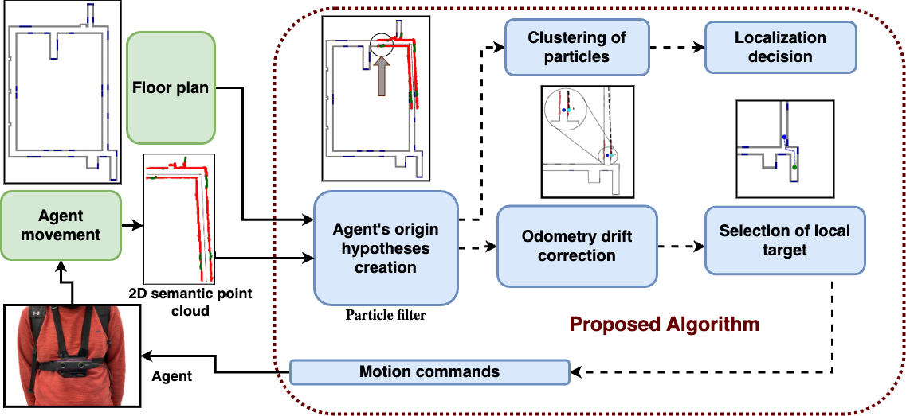

<!--# FloorPlanLocalization-->
# Blank Slate Localization: Active Global Localization from Arbitrary Locations using Semantic Floor Plans

## 📄 Abstract

Floor plan based active global localization refers to the problem of localizing an agent in the floor plan while giving it control commands so as to efficiently minimize the localization error and time. It is generally formulated as an optimization problem where the agent's real-time sensor data is matched against the map to minimize a cost function.
However, most existing methods either assume some {\em a priori} knowledge of the starting position of the agent or consider floor plans that are created using sensors the same as the ones on the agent. In this work, we propose Blank Slate Localization (BSL): a novel methodology for architectural floor plan based active localization for indoor navigation starting from completely unknown initial locations. Semantically aware {\em a priori} map based real-time goals are created for the agent to intelligently explore the local environment while simultaneously constructing a 2D semantic point cloud to globally localize the agent. To account for the time-varying odometry drift, a method is proposed to dynamically correct it based on the floor plan without knowing the global pose of the agent. Furthermore, a novel methodology for real-time bi-directional loop closure has been used. The efficacy of the proposed pipeline has been shown by conducting several experiments on indoor environments. 

## 📊 Results

### Mean and standard deviation of the distance traveled (meters) for successful localization
| Method             | Candidate creation (Mean) | Candidate creation (Std) | Candidate confirmation (Mean) | Candidate confirmation (Std) |
|--------------------|--------------------------|---------------------------|-------------------------------|----------------------------|
| Left wall follower | 13.25                    | 10.55                     | 15.64                         | 11.63                      |
| Random coin toss   | 15.03                    | 13.96                     | 17.62                         | 15.66                      |
| Our method         | 11.27                    | 9.31                      | 13.25                         | 10.36                      |

### Mean and standard deviation of the distance traveled (meters) from start to target
| Method                 | Distance travelled (Mean) | Distance travelled (Std) |
|------------------------|---------------------------|--------------------------|
| Min. possible distance | 32.92                         | 18.29                        |
| Left wall follower     | 52.03                     | 20.88                    |
| Random coin toss       | 51.19                     | 21.78                    |
| Our method             | 44.97                     | 20.20                    |

## 📑 Abalation Study
$R_1=L_4$, $R_2=L_{12}$, $R_3=L_{10}$, $R_4=L_{16}$, $R_5=L_{7}$ from the tables at the end.
### Distance traveled for localization (in meters)
|             | $R_1$ | $R_2$ | $R_3$ | $R_4$ | $R_5$ | Avg. |
|-------------|-------|-------|-------|-------|-------|------|
| Our method  | 4.9   | 4.1   | 18.1  | 16.4  | 9.4   | 10.6 |
| No Loop Closure | 5.8 | 4.4 | 22 | 15.5 | 15.2 | 12.6 |
| No Drift Correction | 4.1 | 13.5 | 13.6 | 13.2 | 11.1 | 11.1 |
| Path to Target | 16 | 3.8 | 40.4 | 9.5 | 20.3 | 18 |

### Distance traveled for overall navigation (in meters)
|             | $R_1$ | $R_2$ | $R_3$ | $R_4$ | $R_5$ | Avg. |
|-------------|-------|-------|-------|-------|-------|------|
| Our method  | 36.6  | 55.3  | 68.7  | 26.4  | 41.8  | 45.7 |
| No Loop Closure | 47.2 | 58.5 | 76.4 | 21.5 | 72.8 | 55.3 |
| No Drift Correction | 36 | 23.2 | - | - | - | - |
| Path to Target | 16.5 | 60.2 | 64.7 | 17.4 | 44.5 | 40.6 |

## TEST BLOCK                                                                                                                                  
### Experiment paths ($10$ units $=$ $1$ m)

*Figure 1: Environment 1 FloorMap*

<a href="#" style="float: right;"> <!-- An anchor tag with a right float style -->

| Index | Starting Point (X) | Starting Point (Y) | End Point (X) | End Point (Y) | Candidate Creation | Candidate Confirmation |
| ----- | ------------------- | ------------------- | -------------- | -------------- | ------------------ | ------------------ |
| $L_1$     | 95                  | 390                 | 10             | 270            | 9.13              | 28.89            |
| $L_2$     | 250                 | 77                  | 10             | 270            | 39.58             | 79.75            |
| $L_3$     | 250                 | 250                 | 10             | 270            | 38.77             | 89.17            |
| $L_4$     | 50                  | 70                  | 10             | 270            | 39.55             | 114.39           |
| $L_5$     | 26                  | 390                 | 10             | 270            | 60.96             | 152.47           |
| $L_6$     | 115                 | 320                 | 50             | 70             | 17.73             | 32.74            |
| $L_7$     | 210                 | 450                 | 50             | 70             | 4.98              | 17.26            |
| $L_8$     | 195                 | 70                  | 50             | 70             | 0.21              | 5.46             |
| $L_9$     | 277                 | 70                  | 50             | 70             | 9.72              | 80.81            |
| $L_{10}$    | 127                 | 392                 | 50             | 70             | 4.11              | 17.17            |
| $L_{11}$    | 275                 | 70                  | 115            | 330            | 6.68              | 19.66            |
| $L_{12}$    | 10                  | 385                 | 115            | 330            | 1.25              | 12.63            |
| $L_{13}$    | 248                 | 248                 | 115            | 330            | 18.12             | 44.84            |
| $L_{14}$    | 70                  | 70                  | 115            | 330            | 8.83              | 30.43            |
| $L_{15}$    | 210                 | 450                 | 115            | 330            | 16.42             | 49.80            |
| $L_{16}$    | 50                  | 390                 | 250            | 200            | 21.59             | 84.96            |
| $L_{17}$    | 230                 | 70                  | 250            | 200            | 17.44             | 83.55            |
| $L_{18}$    | 250                 | 250                 | 250            | 200            | 8.28              | 26.88            |
| $L_{19}$    | 118                 | 70                  | 250            | 200            | 9.43              | 29.74            |
| $L_{20}$    | 10                  | 240                 | 250            | 200            | 20.82             | 48.61            |

</a>

               
*Figure 2: Environment 2 FloorMap*

<a href="#" style="float: right;"> <!-- An anchor tag with a right float style -->

| Index | Starting Point (X) | Starting Point (Y) | End Point (X) | End Point (Y) | Candidate Creation | Candidate Confirmation |
| ----- | ------------------- | ------------------- | -------------- | -------------- | ------------------ | ------------------ |
| $L_{21}$     | 198                 | 135                 | 155            | 470            | 7.24              | 29.31            |
| $L_{22}$     | 225                 | 465                 | 155            | 470            | 6.01              | 28.36            |
| $L_{23}$     | 8                   | 131                 | 155            | 470            | 1.17              | 12.58            |
| $L_{24}$     | 220                 | 133                 | 175            | 75             | 0.99              | 8.95             |
| $L_{25}$     | 266                 | 382                 | 175            | 75             | 12.85             | 58.63            |
| $L_{26}$     | 10                  | 255                 | 175            | 75             | 2.59              | 16.38            |
| $L_{27}$     | 219                 | 490                 | 175            | 75             | 0.01              | 0.12            |
| $L_{28}$     | 170                 | 135                 | 219            | 490            | 5.82              | 33.51            |
| $L_{29}$     | 268                 | 219                 | 219            | 490            | 11.95             | 42.00            |
| $L_{30}$    | 8                   | 415                 | 219            | 490            | 11.80             | 51.17            |

</a>

